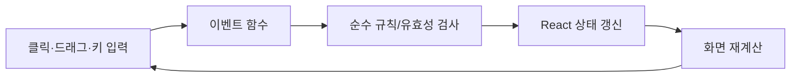

# Python 사용자를 위한 코드 가이드

마지막 갱신: 2026-10-03

이 문서는 Python 문법에는 익숙하지만 TypeScript·React는 처음인 사람이 현재 DTTS 코드를 읽고 안전하게 수정할 수 있도록 쓴 안내서다.

## 1. 프로그램의 기본 모양

Python 프로그램은 흔히 위에서 아래로 실행하거나 함수 호출을 기다린다. 이 게임의 React 화면은 **현재 상태를 입력받아 화면을 계산하는 큰 함수**에 가깝다.

```tsx
export default function Home() {
  // 상태
  // 상태를 바꾸는 이벤트 함수
  // 현재 상태로 그릴 화면
}
```

Python으로 비유하면 프레임워크가 다음 반복을 대신 수행한다.

```python
while True:
    event = wait_for_user_input()
    state = update_state(state, event)
    screen = render(state)
```

실제로 무한 반복문을 작성하지는 않는다. 클릭, 드래그, 턴 종료 같은 이벤트가 상태를 바꾸면 React가 필요한 화면을 다시 계산한다.

## 2. 먼저 알아둘 TypeScript

### `type`: 데이터의 모양

```ts
type MapEnemy = {
  id: string;
  x: number;
  y: number;
  awareness: "sleeping" | "awake" | "alerted";
};
```

Python의 `dataclass`와 비슷하다.

```python
@dataclass
class MapEnemy:
    id: str
    x: int
    y: int
    awareness: Literal["sleeping", "awake", "alerted"]
```

TypeScript 타입은 실행 중 데이터를 저장하는 기능이 아니라, 코드를 작성할 때 잘못된 값과 빠진 필드를 잡는 검사 장치다.

### `const`, `let`, `...`

- `const`: 변수 이름에 다른 값을 다시 대입하지 않는다.
- `let`: 나중에 다른 값을 대입할 수 있다.
- `{ ...old, hp: 10 }`: `old`를 복사하고 `hp`만 바꾼 새 객체다.
- `[...old, item]`: 기존 배열을 복사해 `item`을 뒤에 붙인 새 배열이다.

React 상태에서는 기존 객체를 직접 고치기보다 새 객체와 배열을 만드는 방식이 중요하다.

```ts
setPlayer((current) => ({ ...current, hp: current.hp - damage }));
```

Python으로 보면 다음 변환에 가깝다.

```python
player = {**player, "hp": player["hp"] - damage}
```

### 배열 처리

```ts
const living = enemies.filter((enemy) => enemy.hp > 0);
const names = living.map((enemy) => enemy.name);
```

```python
living = [enemy for enemy in enemies if enemy.hp > 0]
names = [enemy.name for enemy in living]
```

### JSX

```tsx
<button onClick={endTurn}>턴 종료</button>
```

HTML처럼 보이지만 TypeScript 함수 안에서 화면 구조를 표현하는 JSX다. `{...}` 안에는 JavaScript 표현식이나 함수가 들어간다.

## 3. React 상태에서 특히 조심할 점

```ts
const [screen, setScreen] = useState<Screen>("map");
```

- `screen`: 현재 값
- `setScreen`: 값을 바꾸고 다시 그리게 하는 함수
- `"map"`: 첫 값

기존 상태를 직접 수정하면 React가 변경을 놓치거나 이전 상태까지 오염될 수 있다.

```ts
// 피해야 함
game.energy = 2;

// 권장
setGame((current) => ({ ...current, energy: 2 }));
```

한 이벤트에서 여러 상태를 바꾸는 함수가 많으므로, 수정할 때는 함수 초반의 검증과 후반의 모든 `set...` 호출을 함께 확인해야 한다.

## 4. 현재 파일 지도

| 파일 | 게임에서 맡는 역할 |
|---|---|
| `app/page.tsx` | 앱 상태 연결, 지도·전투 이벤트와 화면 조립 |
| `app/components/MapBoard.tsx` | 지도 카메라를 연결하고 보이는 방·적·표식을 계산해 지도판 표시 |
| `app/components/ExtractionShrineModal.tsx` | 추출 카드 선택·정렬·드래그·결과 표시 |
| `app/components/CardConversionShrineModal.tsx` | 변환·조합 카드 선택·드래그·결과 상태와 화면 |
| `app/components/BattleHandArea.tsx` | 손패 배치·카드 입력·버리기·연구 카드 회수 화면 |
| `app/components/BattlePileZone.tsx` | 파일 배치·솔리테어 대상 강조·가로 이동 입력 화면 |
| `app/hooks/useBattleInteractionState.ts` | 전투 카드 선택·드래그·중앙 드롭 상태 |
| `app/hooks/useBattlePointerInput.ts` | 전투 포인터 드래그·파일 자동 스크롤·손패 키보드 입력 |
| `app/hooks/useRunSaveLifecycle.ts` | 진행 스냅샷 저장, 지연 저장과 주기적 저장 타이머 |
| `app/game/cards.ts` | 카드 타입, 카드 정의, 획득 풀, 전투 토큰 카드 생성 |
| `app/game/cardEffects.ts` | 카드 비용, 키워드, 재련과 솔리테어 배치 판정 |
| `app/game/battleHandRules.ts` | 전투 중 스페이스로 실행하는 손패 코스트·희귀도 정렬 |
| `app/cardTextLayout.ts` | 카드 효과 문장 나누기와 카드 너비에 맞춘 글자 크기 계산 |
| `app/cardConstellations.ts` | 카드 워터마크용 별자리 생성과 SVG 이미지 변환 |
| `app/components/CardFace.tsx` | 카드 앞면, 효과 설명, 수치 강조와 글자 맞춤 표시 |
| `app/components/DeckName.tsx` | 덱 이름과 에디션을 표시하는 재사용 화면 컴포넌트 |
| `app/components/MapTopbar.tsx` | 지도 상단 체력·골드·덱 보기·대기·덱 편집 UI |
| `app/hooks/useMapCamera.ts` | 지도 뷰포트 크기, 확대·축소, 이동과 카메라 포커스 |
| `app/hooks/useMapKeyboardMovement.ts` | WASD·방향키·숫자패드 지도 이동과 입력 타이머 |
| `app/hooks/useMapKeyboardShortcuts.ts` | 지도 단축키, 방 행동, 오버레이 닫기 입력 |
| `app/hooks/useRunKeyboardControls.ts` | F8 저장, R 길게 누르기 초기화와 진행 표시 |
| `app/hooks/useDeckEditorSession.ts` | 덱 편집 세션의 원본 스냅샷과 시작·확정 처리 |
| `app/hooks/useFloatingPreviews.ts` | 카드 키워드 팝오버와 카드·티켓·에디션 툴팁 동작 |
| `app/components/MapRoomButton.tsx` | 지도 방 버튼, 접근성 이름과 방 유형 표시 |
| `app/components/MapDeckSelector.tsx` | 지도 화면에서 전투 덱을 고르는 메뉴 |
| `app/components/MapDebugToolbar.tsx` | 지도 디버그 아이템·덱 생성 도구와 적 도감 연결 |
| `app/components/MapEntityMarkers.tsx` | 지도 폭탄·적·플레이어 표식 표시 |
| `app/components/MapRoomActions.tsx` | 현재 방 행동 안내와 바닥 아이템 빠른 줍기 UI |
| `app/components/DeckViewerModal.tsx` | 보유 덱·카드 목록을 보는 모달 |
| `app/components/BattleDeckCheckModal.tsx` | 전투 전에 사용할 덱 선택과 구성 미리보기 |
| `app/components/CardKeywordPopover.tsx` | 카드 키워드 팝오버 배치와 표시 |
| `app/components/CardKeywordSections.tsx` | 키워드 설명을 유형별 구역으로 표시 |
| `app/components/ConstellationPreview.tsx` | 카드 테마 설정의 별자리 SVG 미리보기 |
| `app/components/EnemyIntentIcons.tsx` | 적 의도 피해·상태 표시 아이콘 |
| `app/components/BattleEnemyUnit.tsx` | 전투 중 적 체력·상태·의도와 선택 버튼 표시 |
| `app/components/BattlePlayerPanel.tsx` | 전투 중 플레이어 체력·방어·상태 표시 |
| `app/components/BattleResultOverlay.tsx` | 전투 승패와 보상, 다음 진행 버튼 표시 |
| `app/components/DebugEnemyCodex.tsx` | 디버그 적 도감 화면 |
| `app/components/DeckEditorCardIcon.tsx` | 덱 편집·통계 화면에서 재사용하는 카드 요약 표시 |
| `app/components/CardPoolStatsPanel.tsx` | 카드 풀 통계 계산과 디버그 패널 |
| `app/components/cardAnimations.ts` | 카드가 전투 화면 사이를 이동하는 DOM 애니메이션 |
| `app/game/defenseRules.ts` | 강인함·방어 배율을 포함한 공통 방어 획득 계산 |
| `app/game/ticketRules.ts` | 인벤토리·바닥 티켓의 존재·종류 확인과 소모 판정 |
| `app/game/shopRules.ts` | 티켓 종류·등급과 기준 가격 |
| `app/game/rewards.ts` | 덱 케이스, 에디션, 티켓, 전투 보상 생성 |
| `app/game/rewardRules.ts` | 희귀 카드 누적 확률 규칙 |
| `app/game/battleState.ts` | 전투 초기 상태, 파일 배치와 드로우 전이 |
| `app/game/battleUiTypes.ts` | 전투 단계, 드래그, 피해 팝업의 공유 타입 |
| `app/game/deckEditorRules.ts` | 덱 편집 이동의 유효성 판정 |
| `app/game/deckEditorTransitions.ts` | 덱·인벤토리·바닥 카드 컬렉션 이동 전이 |
| `app/game/deckEditorViews.ts` | 덱 편집 카드 그룹화와 정렬 보기 |
| `app/game/runTypes.ts` | 저장·전투·보상 흐름에서 공유하는 탐험 타입 |
| `app/game/telemetrySnapshots.ts` | 카드·덱·적 텔레메트리 스냅샷 생성 |
| `app/game/cardPlayAction.ts` | 카드 사용 시 효과·피해·상태 전이 처리 |
| `app/game/drawCards.ts` | 턴 시작과 카드 효과에 따른 손패 드로우 처리 |
| `app/game/endTurnAction.ts` | 턴 종료, 적 행동, 다음 턴 준비 처리 |
| `app/game/pileActions.ts` | 파일 이동, 파일 선택 드로우와 연구 드로우 처리 |
| `app/game/mapRules.ts` | 지도 지역·노드·안전 지대·보스 위치·바닥 드롭 생성 |
| `app/game/mapEffects.ts` | 지도 폭탄의 이동 카운트와 피해 계산 |
| `app/game/enemies.ts` | 1~3지역 일반 조우와 보스, 적 행동 선택, 피해·상태 보조 규칙 |
| `app/game/mapEnemies.ts` | 지도 적 생성, 인식 상태, 시야 활성화, 거리장, 동시 이동과 충돌 |
| `app/game/mapTurn.ts` | 한 지도 턴에서 적 이동과 플레이어 충돌 결과 계산 |
| `app/game/cardRules.ts` | 리셔플 제외 카드 필터와 고정·균등 파일 분배 |
| `app/game/statuses.ts` | 저항·취약 등 상태 계산 |
| `app/game/deckEditorRules.ts` | 원래 위치, 안전 지대, 고정 희귀 슬롯, 추출 티켓을 고려한 카드 이동 판정 |
| `app/game/saveGame.ts` | 버전이 붙은 탐험 진행의 `localStorage` 읽기·쓰기·삭제 |
| `app/game/runSaveState.ts` | 진행 스냅샷의 집합 직렬화와 구버전 저장 필드 정리 |
| `tests/map-turn.test.mjs` | 지도 턴 적 이동과 충돌 결과 |
| `tests/run-save-state.test.mjs` | 저장 스냅샷 직렬화와 복원값 정규화 |
| `app/game/telemetry.ts` | 런·전투 통계, `localStorage` 저장, TXT 내보내기 데이터 |
| `app/globals.css` | 카드, 지도, 팝업, 애니메이션과 반응형 화면 |
| `app/layout.tsx` | 페이지 제목, 메타데이터, 전체 HTML 틀 |
| `tests/card-rules.test.mjs` | 리셔플 카드 필터와 파일 분배 |
| `tests/card-text-layout.test.mjs` | 카드 효과 문장 배치와 줄맞춤 계산 |
| `tests/cards.test.mjs` | 카드 정의와 카드 풀 |
| `tests/card-effects.test.mjs` | 카드 비용·재련·배치 규칙 |
| `tests/combat-economy.test.mjs` | 에너지 지불·회복과 공격 계산 |
| `tests/deck-editor-rules.test.mjs` | 덱 편집 이동 권한과 제한. `npm test`에 포함 |
| `tests/blessing-rules.test.mjs` | 축복 선택, 피해 처리, 중복 효과 판정 |
| `tests/enemies.test.mjs` | 적 수치, 행동, 특수 상태와 피해 규칙 |
| `tests/map-effects.test.mjs` | 지도 티켓·폭탄·시야 등 효과 |
| `tests/map-enemies.test.mjs` | 인식 상태, 거리장, 다중 적 이동과 충돌 |
| `tests/rewards.test.mjs` | 보상·덱 생성 규칙 |
| `tests/statuses.test.mjs` | 저항·취약 상쇄와 피해 계산 |
| `tests/ticket-rules.test.mjs` | 티켓 찾기·소모·그룹 처리 |
| `tests/telemetry.test.mjs` | 텔레메트리 기록·내보내기. 현재 `npm test`에는 미포함 |
| `tests/rendered-html.test.mjs` | 첫 화면 서버 렌더링 |
| `package.json` | 실행·검사 명령과 라이브러리 |
| `next.config.ts` | GitHub Pages 정적 경로와 Turbopack 프로젝트 루트 설정 |
| `.github/workflows/deploy-pages.yml` | `main` push 뒤 Pages 배포 절차 |

카드 효과 문장을 수정할 때는 대괄호 `[ ... ]` 안에 재련 후 효과를 미리 표시한다. 대괄호 밖에는 현재 효과를 적고, 재련 전에도 괄호 안 효과가 발동하는 것처럼 설명하지 않는다.

`db/`, `drizzle/`, `examples/`는 현재 게임 플레이에 쓰지 않는 예제 골격이다. `.next/`, `dist/`, `out/`, `node_modules/`는 생성물 또는 외부 코드이므로 직접 편집하지 않는다.

## 5. 코드를 읽는 권장 순서

`app/page.tsx`는 현재 205,058바이트(약 200KiB), 4,636줄이다. 앱 상태 연결과 화면 이벤트는 이 파일이 맡고, 지도 턴의 적 이동·충돌 계산은 `mapTurn.ts`, 저장 집합 직렬화와 구버전 저장값 정리는 `runSaveState.ts`로 나뉘었다. 저장 대상 상태를 골라 스냅샷에 넣는 연결부와 복원한 값을 React 상태에 적용하는 부분은 `page.tsx`에 남아 있다. 다음 분리는 크기보다 상태와 동작이 함께 바뀌는 경계를 기준으로 검토한다. 파일 크기는 유지보수 부담을 가늠하는 값이며, 실행 속도 저하를 뜻하지 않는다.

1. `docs/GAME_DESIGN.md`로 현재 규칙의 전체 모양을 본다.
2. `app/game/cards.ts`에서 카드 타입과 카드 풀을 본다.
3. `app/game/mapRules.ts`, `app/game/rewards.ts`, `app/game/battleState.ts`, `app/game/saveGame.ts`에서 지도·보상·전투 시작·저장 규칙을 본다.
4. `enemies.ts`의 `ENCOUNTERS`, `ENCOUNTER_INDICES_BY_REGION`, `BOSS_ENCOUNTER_INDICES`를 본다.
5. `mapEnemies.ts`에서 적 인식과 이동 함수들을 본다.
6. `rewards.ts`의 `createDeck`, `rollRegionDeckShape`, `createRegionDeck`, `createBattleReward`를 찾아 덱과 보상 생성을 본다.
7. `Home()`의 `useState` 목록에서 실제로 보관하는 상태를 본다.
8. `moveOnMap`에서 플레이어 이동→적 행동→충돌 순서를 본다.
9. `playCard`, 카드 효과 처리, `moveCardToPile`, `endTurn`에서 전투 한 턴을 본다.
10. 덱 편집 이벤트와 `deckEditorRules.ts`를 함께 본다.
11. 마지막 JSX에서 `screen`에 따라 지도·전투·팝업이 어떻게 갈리는지 본다.

함수의 정의와 호출 관계가 필요할 때는 이름 검색만으로 추측하지 말고 코드 그래프나 TypeScript 언어 서버의 “정의로 이동/참조 찾기”를 사용한다.

## 6. 주요 데이터 흐름



### 지도 이동 한 번

1. 목적지가 이동 가능한지 검사한다.
2. 플레이어 위치와 이동 횟수를 갱신한다.
3. 폭탄, 심안, 운동선수처럼 이동 횟수에 묶인 효과를 처리한다.
4. 활성 범위 적들의 상태와 목적지를 계산한다.
5. 적 이동을 동시에 적용한다.
6. 충돌하면 해당 적의 조우로 전투를 만든다.
7. 새 시야와 적 기억을 갱신한다.

### 카드 사용 한 번

1. 카드 비용, 대상, 사용 가능한 카드인지 검사한다.
2. 에너지를 지불한다.
3. 공격·방어·드로우·상태·룰 등 카드 효과를 계산한다.
4. 적 사망, 가시 반격, 추가 효과를 처리한다.
5. 카드를 버림·소멸·룰 영역 중 알맞은 곳으로 보낸다.
6. 전투 텔레메트리에 사용 카드와 피해를 기록한다.

### 솔리테어 이동 한 번

1. 손패 카드인지 파일 묶음인지 확인한다.
2. `page.tsx`의 솔리테어 배치 규칙으로 대상 파일이 가능한지 검사한다.
3. 이동 전 목적지 맨 위 카드를 기준으로 이동 카드 각각의 재련 조건과 강화 횟수를 검사한다.
4. 별 1개를 지불한다.
5. 출발지와 목적지 파일을 새 배열로 만든다.
6. 새로 드러난 파일 맨 위 카드를 앞면으로 표시한다.

### 덱 편집 이동 한 번

1. 편집 시작 때 카드별 원래 덱 ID를 저장한다. 편집 중 새로 덱에 넣는 희귀·전설 카드는 넣기 직전 인벤토리·바닥 위치도 기억한다.
2. 현재 위치, 목적지, 안전 지대 여부, 희귀 슬롯 수, 추출 티켓 등급을 `deckEditorRules.ts`에 넘긴다.
3. 규칙이 허용한 경우에만 덱·인벤토리·제거 예정·바닥 상태를 갱신한다. 희귀·전설 카드는 원래 위치 되돌리기, 제거 예정, 추출 티켓+ 경로를 구분한다.
4. 확정할 때 덱 최소 1장, 덱 용량, 인벤토리 용량을 다시 검사한다.

## 7. 게임 상태와 영구 저장은 다르다

React의 `useState`는 현재 열린 페이지가 살아 있는 동안의 메모리다. 탐험 진행 일부는 별도의 저장 코드가 `localStorage`에서 복원한다. 저장 대상은 맵 화면 상태이며, 전투 중이거나 덱 편집 중인 상태는 저장하지 않는다. 패배하거나 새 탐험을 시작하면 진행 저장을 지운다.

`saveGame.ts`는 버전 1 저장 봉투를 읽고 쓴다. 현재 진행 저장과 `telemetry.ts`의 전투 기록은 별도 항목이다. 진행 저장을 확장할 때는 다음을 검토한다.

- 저장할 상태와 다시 계산할 상태의 구분
- 카드·덱·적 ID의 안정성
- 무작위 결과와 지도 생성 상태
- 저장 버전과 이전 버전 마이그레이션
- 전투 중 상태를 저장할지 여부

## 8. CSS와 화면 수정

`app/globals.css`는 카드 크기, 지도 셀, 팝업 위치, 애니메이션과 작은 화면 배치를 담당한다.

```css
.card {
  width: 100px;
  height: 142px;
}
```

```tsx
<article className="card">...</article>
```

UI가 겹치거나 잘리면 브라우저 개발자 도구에서 실제 클래스와 계산된 크기를 먼저 확인한다. 같은 카드가 손패, 파일, 상점, 보상, 덱 편집에서 서로 다른 부모 레이아웃 안에 있으므로 `.card` 하나만 고치면 다른 화면이 깨질 수 있다.

## 9. 새 콘텐츠는 데이터 경로까지 확인하기

배열에 객체를 추가했다고 자동으로 일반 플레이에 등장하는 것은 아니다.

예를 들어 전설 카드는 `LEGENDARY_CARD_POOL`과 디버그 목록에는 있지만 현재 보상·상점·발견 덱 생성 경로에는 연결되지 않는다. 적도 `ENCOUNTERS`에 추가한 뒤 지역 인덱스 또는 보스 인덱스에 연결해야 지도에서 등장한다.

새 콘텐츠를 넣을 때 확인할 경로:

1. 데이터 정의
2. 무작위 선택 풀 또는 고정 배치 연결
3. 실제 효과 처리
4. 화면 설명과 미리보기
5. 텔레메트리·저장 호환성
6. 단위 테스트와 실제 플레이

## 10. 안전한 수정 원칙

- 카드 이름만 같다고 같은 카드를 뜻한다고 가정하지 않는다. 인스턴스 ID와 카드 정의를 구분한다.
- 덱은 배열 위치가 아니라 덱 ID로 식별한다.
- 맵 적은 `enemies.ts`의 전투 조우와 `mapEnemies.ts`의 지도 인스턴스를 혼동하지 않는다.
- 랜덤 수치를 바꿀 때 생성 확률, 보상 확률, 누적 보정 확률을 구분한다.
- 카드 효과 수치를 바꾸면 카드 설명, 전투 처리, 디버그 통계, 테스트를 함께 확인한다.
- 적 행동을 바꾸면 의도 표시, 실제 피해, 상태 적용 시점, 다음 행동 선택을 함께 확인한다.
- 이미 삭제한 카드 활성화/비활성화와 적 열정/각성을 되살리지 않는다.
- 큰 기능은 가능하면 데이터, 순수 규칙, 화면 표현을 분리한다. `page.tsx`를 더 키우기 전에 새 모듈을 검토한다.

## 11. 실행과 검사

처음 한 번:

```powershell
npm install
```

개발 서버:

```powershell
npm run dev
```

기본 주소는 `http://localhost:3000`이다. 코드를 저장하면 보통 개발 서버가 자동으로 다시 반영한다.

변경 뒤 검사:

```powershell
npm run lint
npm test
node --experimental-strip-types --test tests/deck-editor-rules.test.mjs
$env:GITHUB_ACTIONS='true'; npm run build:pages
```

- `npm run lint`: TypeScript·React 정적 검사
- `npm test`: Vinext 빌드, 규칙 테스트 파일 13개, 첫 화면 서버 렌더링 검사
- `tests/telemetry.test.mjs`는 파일로 존재하지만 현재 `npm test` 스크립트에는 포함되지 않는다.
- `npm run build:pages`: GitHub Pages용 정적 빌드

문서만 바꾼 경우에도 최소한 diff를 확인한다. 규칙과 코드를 함께 바꿨다면 관련 단위 테스트뿐 아니라 위 세 검사를 가능한 범위에서 모두 실행한다.

## 12. Git과 배포

- commit: 관련 변경 한 덩어리에 이름을 붙여 로컬 이력으로 저장
- push: 로컬 commit을 GitHub로 전송
- GitHub Actions: `main` push를 감지해 Pages 빌드·배포 시도

공개 주소는 `https://dhwangdo.github.io/ruinfall/`다.

최근 배포 실패 중에는 코드가 실행되기 전 GitHub runner가 시작하지 못한 `startup_failure` 사례도 있었다. 배포가 실패하면 먼저 로컬 빌드 결과와 Actions 로그를 나눠서 확인한다.
