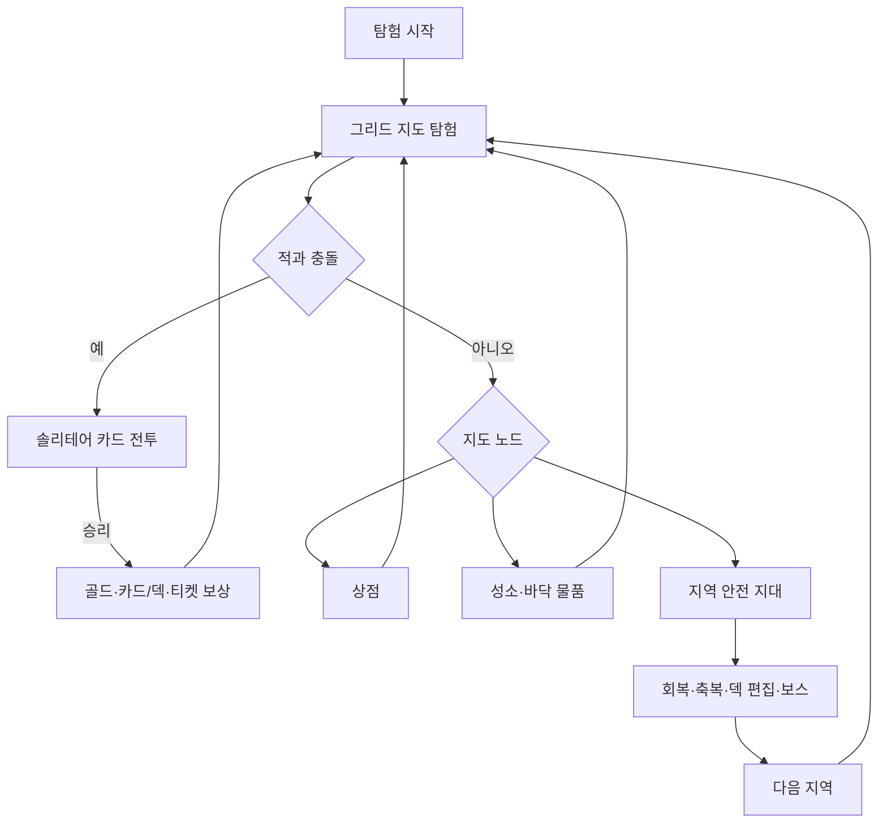

# 현재 게임 규칙

마지막 갱신: 2026-10-05

이 문서는 과거 기획안이 아니라 갱신 당시 **현재 작업 트리에 구현된 규칙**을 설명한다. 세부 수치가 충돌하면 `app/` 코드와 `tests/`를 우선한다.

## 1. 게임의 큰 흐름

핵심은 두 층이다. 지도에서는 제한된 시야 안에서 움직이는 적과 지형을 읽고 경로를 선택한다. 전투에서는 여러 파일에 쌓인 카드를 꺼내 쓰거나 솔리테어 규칙으로 재배열하여 덱의 순서와 효과를 관리한다.

## 2. 지도와 탐험

### 지도 크기와 이동

- 가로 좌표는 `-160~160`이다.
- 총 7개 지역의 틀이 있으며, 모든 지역은 세로 15칸이다.
- 지역 사이에는 단단한 바위 5줄이 있다.
- 플레이어와 적은 상하좌우·대각선을 포함한 8방향으로 이동한다.
- 기본 시야는 플레이어 중심 반경 2, 즉 최대 5×5다. 바위로 연결이 끊긴 칸은 같은 정사각형 안이어도 보이지 않는다.
- 이미 방문한 길을 클릭하면 자동 이동할 수 있다. 새 적이 시야에 들어오면 안전을 위해 자동 이동을 멈춘다.
- 지도 카메라는 드래그 및 확대·축소할 수 있다.

### 일반 지도 생성

| 요소 | 현재 규칙 |
|---|---|
| 특수 노드 | 일반 칸마다 0.6%. 노드 종류는 아래 가중치로 선택 |
| 바위 군집 | 일반부 약 3%, 가장자리 약 5% |
| 지역 포탈 | 지역 마지막 줄에서 5%, 없으면 하나 보장 |
| 바닥 물품 | 빈칸마다 0.5% |

특수 노드의 종류별 가중치는 다음과 같다. 이 값은 노드 종류를 고르는 상대 비율이다.

| 노드 | 가중치 |
|---|---:|
| 추출의 성소 | 2 |
| 심안·변환·조합의 성소 | 각각 1 |
| 상점·건강의 성소·보물 상자 | 각각 0.5 |
| 축복 | 0.01 |

바닥 물품은 카드 80%, 티켓 20%다. 카드인 경우 희귀 5%, 일반 30%, 특별 65% 비율로 풀을 고른다.

| 노드 | 효과 |
|---|---|
| 추출의 성소 | 덱 하나에서 희귀 카드를 제외하고 최대 2장을 바닥으로 꺼낸다. |
| 건강의 성소 | 최대 체력 +5. 현재 체력은 바뀌지 않는다. |
| 심안의 성소 | 20회 이동 동안 시야 거리 +2를 얻는다. |
| 변환의 성소 | 인벤토리 카드 2장을 변환한다. |
| 조합의 성소 | 특별 카드 5장을 무작위 희귀 카드 1장으로 바꾼다. |
| 보물 상자 | 무작위 보상을 주고 큰 소리를 내 적을 깨울 수 있다. |

지역 포탈은 같은 지역의 안전 지대로 이동시킨다. 안전 지대 포탈은 다음 지역 시작점으로 이동시킨다.

### 오버맵 적

- 새 탐험을 만들 때 유효한 빈칸마다 8% 확률로 일반 적을 미리 배치한다.
- 시작점 반경 2 안에는 일반 적을 생성하지 않는다.
- 1~3지역에만 현재 일반 적 풀이 있다. 4~7지역은 지도 틀만 있고 전투 조우는 없다.
- 적은 3% 확률로 다음 지역 풀에서 조기 출현한다. 다음 풀이 없으면 현재 풀을 쓴다.
- 적 위치는 직접 관측한 칸 단위로 기억된다. 그 칸을 다시 보면 기억을 현재 상태로 갱신한다.
- 플레이어가 적 칸에 들어가거나 적이 플레이어 칸에 들어오면 즉시 전투가 시작된다.

| 표시 | 상태 | 행동 |
|---|---|---|
| `Zzz` | 잠듦 | 이동하지 않는다. 거리 1이면 50%, 거리 2이면 10% 확률로 깨어난다. |
| `?` | 깨어남 | 거리장 3 이상이면 매 턴 10% 확률로 잠든다. 상태가 유지되면 50% 정지, 50% 무작위 이동한다. 가까우면 같은 확률로 경계 상태가 된다. |
| `!` | 경계 | 92% 확률로 플레이어에게 접근하고 8% 정지한다. 직선거리 4 이상이면 `?`로 돌아간다. |

상태 변화 자체가 그 적의 한 행동을 소비한다. 경계 적은 바위와 다른 적을 반영한 8방향 거리장을 사용한다. 여러 적은 먼저 목적지를 예약하고 동시에 움직이므로 같은 칸에 겹치거나 서로 자리를 맞바꾸지 않는다.

## 3. 안전 지대

- 각 지역에는 일반 지도와 떨어진 별도 안전 지대가 있다.
- 모든 안전 지대에는 축복, 전체 회복, 상점, 다음 지역 포탈이 있다.
- 1~3지역에는 추가로 고정 보스 1명, 회복의 성소 1개, 추출의 성소 2개가 있다.
- 보스는 안전 지대 연결부에 고정되고 처음부터 `!` 상태다.
- 보스가 살아 있는 동안 그 안전 지대에서는 덱 편집을 열 수 없다.
- 전체 회복과 축복 선택은 각 노드에서 한 번만 쓸 수 있다.
- 회복의 성소는 최대 체력의 30%를 회복하고 무너진다.
- 추출의 성소는 덱 하나에서 최대 2장을 바닥으로 꺼낸다. 덱에는 최소 1장이 남아야 하며, 사용 뒤 무너진다.

## 4. 현재 조우 목록

일반 적의 실제 체력은 표시 최대치의 90~100% 범위에서 정해진다. 보스는 고정 최대 체력으로 등장한다.

### 1지역

| 조우 | 최대 체력 | 핵심 행동 |
|---|---:|---|
| 작은 마법사 | 30 | 마법 피해 8 반복 |
| 주황 슬라임 | 40 | 시작 시 유독성 점액 1장 투입. 물리 피해 9를 매 턴 반복 |
| 하수구 쥐 | 40 | 물리 5×2 / 물리 10 / 체력 5 회복+힘 3 획득. 매 행동마다 파일 맨 위 카드 1장을 버리며 높은 희귀도를 우선 |
| 쥐 3마리 | 각 10 | 각자 물리 피해 6 반복 |
| 초록 슬라임 | 40 | 물리 피해 10 또는 물리 피해 10+다음 공격 마법화 |
| 보스: 검은 슬라임 | 70 | 시작 시 유독성 점액 2장. 물리 10 / 방어 10+힘 2 순환 |

### 2지역

| 조우 | 최대 체력 | 핵심 행동 |
|---|---:|---|
| 골렘 | 90 | 대기·경고 턴에도 물리 피해 8, 공격 턴에는 물리 피해 30을 가하는 고정 패턴 |
| 도깨비 | 66 | 물리 14 / 8×2 / 7×3. 첫 파일 아래에 유물 토큰 투입 |
| 저주술사 | 55 | 마법 12+다음 턴 물리 취약 2, 이후 물리 12·12 |
| 마나 야수+도깨비불 | 55+20 | 야수는 물리 7+마법 7, 불은 공격 없이 다음 턴 마법 취약 1 |
| 작은 마법사 2마리 | 각 30 | 각자 마법 피해 8 반복 |
| 보스: 광대 | 110 | 물리 20 / 마법 20 / 힘 3 행동마다 무작위 파일 5장 버리기 |

### 3지역

| 조우 | 최대 체력 | 핵심 행동 |
|---|---:|---|
| 미라 사제 | 70 | 시작 가호 5. 가호 2+마법 취약 1 / 마법 16 / 물리 20 |
| 미라 전사 | 100 | 매 플레이어 턴 광폭 1. 물리 4×3 / 16 / 5×2+물리 취약 1 |
| 지룡 | 95 | 모든 파일에 흙 1장+물리 취약 1 / 물리 15 / 마법 20 |
| 가시 딱정벌레 2마리 | 각 45 | 가시 4. 물리 취약 / 물리 10 / 플레이어 힘·강인함 각각 -2 중 직전과 다른 행동 |
| 보스: 거대 지룡 | 150 | 첫 행동 파일마다 돌 2장, 이후 돌 1장+힘 4 / 물리 12 / 물리 6×2 |

가호는 피해를 받는 횟수를 막고, 가시는 공격받을 때 플레이어에게 반격 피해를 준다.

## 5. 플레이어와 덱

| 항목 | 기본값 |
|---|---:|
| 최대 체력 | 50 |
| 인벤토리 | 12칸 |
| 보유 덱 케이스 | 최대 3개 |
| 시작 덱 크기 | 16장 |
| 시작 덱 용량 | 20장 |
| 전투 시작 에너지 | 3 |
| 전투 시작 별 | 2 |

시작 덱은 타격 6장, 방어 4장, 마법 방어 2장, 전투 교본·자와 컴퍼스·기회 창출·별의 장막 각 1장이다. 시작 덱에는 에디션이 붙지 않는다.
새 탐험 시작 시 추가 타격·방어 카드는 지급하지 않는다.

발견한 덱은 지역 번호 `n`만으로 생성한다. 기본 용량은 `20+(n+x)×5`장, 희귀 카드 수는 `n+y`장, 에디션 예산은 `(n+z)×10`점이다. `덱 크기` 축복은 생성이 끝난 뒤 용량에 5장을 더한다.

희귀 카드는 코스트와 이름을 밝은 금색(`#ffe08a`), 등급 띠를 단색 보라색(`#7138a6`)으로 표시한다. 간소화 스타일은 기존 레이아웃을 유지하며, 희귀 카드 본체 바탕은 일반 카드와 같은 `#f7f4eb`이다. 희귀 카드 테두리는 금색(`#d5a928`) 2px이고, 등급 띠 경계에도 같은 금색 선을 둔다. 텍스처는 희귀 카드 테두리 아래 층에 그린다.

일반 카드 바탕은 전투·목록·덱 편집에서 `#f7f4eb`를 사용한다.

## 6. 전투와 솔리테어

### 전투 시작과 턴

1. 선택한 덱을 섞어 기본 5장씩 파일에 배치한다.
2. 각 파일의 맨 위 카드만 공개한다.
3. 턴 시작에 비어 있지 않은 각 파일 맨 위에서 한 장씩 손으로 가져온다.
4. 카드를 사용하거나 별을 써서 카드·파일 묶음을 재배열한다.
5. 턴 종료 시 남은 손패를 버린 뒤 적이 행동한다.
6. 다음 플레이어 턴에는 방어를 정리하고 에너지를 회복한 뒤 다시 파일마다 한 장씩 뽑는다.

모든 파일이 비면 버린 카드들을 다시 섞는다. 룰 카드, 이번 전투에서 소멸한 카드와 토큰은 다음 리셔플 대상에서 제외된다.

손패는 원호로 최대 9장까지 한 번에 표시한다. 손패가 9장 이상이면 휠로 한 장씩 이동해 볼 수 있다. 가장자리 밖으로 휠을 더 굴릴수록 저항이 강해지고, 휠 입력 중에도 가장자리로 되돌아오는 힘이 작용한다. 전투 중 스페이스를 누르면 그 순간 손패를 코스트 오름차순으로 정렬하고, 같은 코스트는 높은 희귀도부터 둔다. 사용 불가 카드는 비용 -999로 취급해 가장 앞에 둔다. 이후 카드를 뽑거나 버려도 자동으로 다시 정렬하지 않는다.

### 자원과 카드 배치

- 카드 사용은 카드에 적힌 에너지를 쓴다.
- 손패 카드 또는 파일 위쪽의 연속된 카드 묶음을 다른 파일에 놓는 행동은 별 1개를 쓴다.
- 별은 턴마다 자동 회복되지 않는다.
- 파일 배치는 맨 위 규칙, 맨 아래 규칙, 주문 연쇄 규칙을 검사한다.
- 주문 연쇄는 비용이 이어지는 카드로 구성되며, 홍수 피라미드는 4-3-2-1 순서를 사용한다.
- 재련 카드를 조건에 맞는 대상 카드 위에 놓으면 일반 배치와 같은 별 비용을 쓴다. 여러 장을 함께 옮기면 모든 이동 카드가 이동 전 목적지 맨 위 카드와 독립적으로 판정되어 한 번에 여러 장을 재련할 수 있다.

### 피해·방어·상태

- 플레이어 공격에는 힘이 더해진다.
- 물리 방어와 마법 방어는 서로 다른 적 공격만 막는다.
- 강인함은 획득 방어에 더해진다.
- 물리·마법 저항은 대응 피해를 절반으로 줄이고, 취약은 대응 피해를 두 배로 만든다.
- 같은 속성의 저항과 취약은 서로 상쇄된다.
- 보통 방어는 다음 플레이어 턴에 사라진다. `견고한 태세`가 활성화되면 절반을 유지한다.

### 토큰

| 토큰 | 현재 효과 |
|---|---|
| 유독성 점액 | 사용할 수 없으며 턴 종료 때 손에 있으면 마법 피해 12 |
| 흙 | 사용할 수 없는 파일 방해 카드 |
| 돌 | 사용할 수 없는 파일 방해 카드 |
| 유물 | 사용할 수 없으며 도깨비의 힘을 4 낮춤 |

## 7. 카드 체계

### 핵심 키워드

| 키워드 | 의미 |
|---|---|
| 룰 | 사용 후 버려지지 않고 그 전투의 지속 규칙으로 남음 |
| 소멸 | 사용한 전투의 다음 리셔플에서 제외됨 |
| 재련 | 다른 카드 위에 놓아 그 카드의 전투 중 수치·비용 등을 강화 |

카드 효과 설명에서 대괄호 `[ ... ]` 안은 카드를 재련한 뒤의 효과를 미리 보여 준다. 대괄호 밖은 현재 효과이며, 재련 전에는 대괄호 안의 효과가 적용되지 않는다.

### 시작 카드 3종

| 카드 | 비용 | 효과 |
|---|---:|---|
| 타격 | 1 | 피해 6 |
| 방어 | 1 | 물리 방어 5 |
| 마법 방어 | 1 | 마법 방어 5 |

### 일반 카드 6종

| 카드 | 비용 | 효과 |
|---|---:|---|
| 잽 | 0 | 피해 6 |
| 자와 컴퍼스 | 1 | 피해 6, 별 1 획득 |
| 기회 포착 | 1 | 피해 6, 1장 드로우 |
| 기회 창출 | 1 | 물리 방어 5, 1장 드로우 |
| 별의 장막 | 2 | 물리 방어 10, 별 1 획득 |
| 전투 교본 | 사용 불가 | 손패에 있는 동안 카드 피해와 방어 +2 |

### 특별 표시 카드 34종

천문학 연구, 강령학 연구, 금속학 연구, 오시리스 선, 재주넘기, 갈라치기, 빛무리, 대형 프리즘, 성운, 휩쓸기, 정리 타격, 준비 운동, 별빛, 얼음 방패, 5연격, 백스텝, 은검, 전략가, 낡은 노심, 판금 갑옷, 가지치기, 질주, 퀵스텝, 진압, 별의 방주, 응수, 묵직한 한 방, 치환 합금, 청동 철퇴, 철벽, 거울상, 가호, 늑대 부적, 거북이 부적.

- 빛무리: 0코스트. 광채 1장을 손패에 생성한다.
- 대형 프리즘: 3코스트. 광채 3장을 손패에 생성한다.
- 성운: 1코스트. 광채 1장을 손패에 생성하고 ★★를 얻는다.
- 5연격: 1코스트. 피해 2를 5번 준다.
- 백스텝: 0코스트. 방어 5를 얻는다.
- 은검: 1코스트. 피해 12를 주고 마법 방어 5를 얻는다.
- 오시리스 선: 1코스트 룰. 매 턴 시작 시 ★를 얻는다.
- 재주넘기: 1코스트. 방어 9를 얻고 ★를 얻는다.
- 갈라치기: 1코스트. 피해 9를 주고 ★를 얻으며 카드 1장을 뽑는다.
- 늑대 부적: 특별 등급, 사용 불가. 전투 덱에 있는 장수마다 힘 1을 얻는다. 인벤토리나 다른 덱에 있으면 발동하지 않는다.
- 거북이 부적: 특별 등급, 사용 불가. 전투 덱에 있는 장수마다 강인함 1을 얻는다. 인벤토리나 다른 덱에 있으면 발동하지 않는다.
- 퀵스텝: 1코스트. 카드를 2장 뽑는다.
- 광채: 0코스트 토큰 공격. 기본 피해 4이며, 이번 턴에 먼저 사용한 다른 광채마다 피해가 4 증가한다.

이 그룹에는 룰·소멸·재련, 드로우와 자원 변환, 광역 공격, 반사, 수동 지속 효과 등 전투 구조를 바꾸는 카드가 집중되어 있다. 개별 수치의 단일 기준은 `app/game/cards.ts`의 카드 정의이며, 비용·재련·배치 판정은 `app/game/cardEffects.ts`에 있다.

### 희귀 표시 카드 13종

흑요석 단검, 연사, 전술가, 마도서, 초신성, 유성우, 대분배, 견고한 태세, 법학 연구, 경제학 연구, 광학 연구, 광행시간, 오딘의 창.

- 법학 연구: 0코스트 룰. 내 룰 카드 비용을 1 낮춘다.
- 경제학 연구: 2코스트 룰. 사용한 장마다 에너지 사용 하한이 -3씩 내려간다.
- 연사: 1코스트, 소멸. 다음에 사용하는 공격 카드가 두 번 발동하며, 공격할 때까지 턴이 지나도 효과가 유지된다.
- 마도서: 손패에 있는 동안 카드를 낼 때마다 마법 피해 1을 받고 ★를 얻는다.
- 유성우: ★를 모두 소모하고 그 수만큼 무작위 적을 공격한다.
- 광행시간: 1코스트. 다다음 턴 시작 시 광채 3장을 손패에 생성한다.
- 초신성: ★★★를 잃고 에너지 3을 얻는다.
- 대분배: 0코스트 룰. 빈 파일을 추가하고, 이후 리셔플 때 파일의 카드 수를 균등하게 맞춘다.
- 견고한 태세: 2코스트. 방어 10을 얻고 턴 종료 시 방어와 마법 방어를 절반 보존한다.
- 광학 연구: 0코스트 룰. 매 플레이어 턴 시작 시 활성화된 장마다 광채 1장을 손패에 생성한다.
- 턴 시작 에너지는 `min(현재 에너지 + 최대 에너지, 최대 에너지)`로 회복한다. 이 규칙은 추가 턴에도 적용한다.

`흑요석 단검`은 비용 2의 희귀 카드다.
공격 카드 위에 최대 5회 재련할 수 있으며, 재련할 때 밑패를 소멸시키고 그 카드의 기본 피해량을 자신의 피해량에 더한다.

### 전설 카드 6종

호롤로지움, 오피쿠우스, 아리에스, 히드라, 오리온, 카시오페이아가 구현 및 디버그 카드 목록에 정의되어 있다. 그러나 현재 일반 전투 보상, 발견 덱 생성, 상점에는 전설 획득 경로가 연결되어 있지 않다.

`무쇠 난동`은 레거시 배열과 디버그 목록에만 남아 있고 일반 획득 풀에는 연결되지 않는다.

## 8. 덱 에디션

발견 덱의 에디션은 지역 생성식의 에디션 예산에서 고른다. 남은 예산 이하이고 충돌하지 않는 에디션만 후보가 되며, 후보별 선택 가중치는 `에디션 점수^1.2`다. 같은 에디션은 중복되지 않으며 `재활용`과 `재활용+`는 함께 생성되지 않는다.

| 에디션 | 점수 | 효과 |
|---|---:|---|
| 추가 파일 | 5 | 전투 시작 시 빈 파일 1개 추가 |
| 재활용 | 5 | 턴 종료 시 남은 에너지 1당 ★ 1개 |
| 방호 태세 | 5 | 전투 시작 시 방어 5 |
| 별+ | 5 | 전투 시작 시 ★ 1개 |
| 드로우+ | 5 | 전투 시작 시 무작위 파일에서 1장 뽑기 |
| 별++ | 10 | 전투 시작 시 ★ 2개 |
| 에너지+ | 10 | 전투 시작 시 에너지 +1 |
| 탐욕 | 20 | 전투 보상 골드 2배 |
| 별+++ | 20 | 전투 시작 시 ★ 3개 |
| 저항 | 30 | 전투 시작 시 물리 저항 1·마법 저항 1 |
| 여백의 미 | 30 | 빈 파일 하나당 힘 +2 |
| 망치질 | 30 | 재련할 때마다 ★ 1개 |
| 하이랜더 | 30 | 중복 카드 없이 덱이 가득 차 있으면 최대 에너지 +1 |
| 지속 드로우 | 40 | 매 턴 시작 시 무작위 파일에서 1장 뽑기 |
| 재활용+ | 40 | 턴 종료 시 남은 에너지 1당 ★ 2개 |
| 별+++++ | 40 | 전투 시작 시 ★ 5개 |
| 에너지+++ | 40 | 전투 시작 시 에너지 +3 |
| 아드레날린 | 50 | 전투 시작 시 아드레날린 카드 1장 |
| 지속 에너지 | 50 | 최대 에너지 +1 |
| 거인 | 50 | 전투 시작 시 힘 +3·강인함 +3 |
| 압축 | 60 | 파일마다 4장씩 배치 |
| 무적 | 100 | 전투 시작 시 무적 1 |

`재활용`과 `재활용+`는 같은 덱에 함께 생성되지 않는다.

## 9. 전투 보상과 발견 덱

- 일반 전투 골드는 지역 번호 `n`에 따라 `floor(10×1.3^(n-1))`~`floor(15×1.3^(n-1))`이다. 보스는 80~100 골드를 준다.
- 탐욕스러운 에디션과 탐욕 축복은 각각 골드를 2배로 만든다.
- 덱 케이스 확률은 25%에서 시작한다. 실패할 때마다 10%p 오르고, 성공하면 25%로 초기화된다.
- 덱 케이스가 나오면 독립 카드 보상은 나오지 않는다. 덱 케이스가 없으면 카드 1장을 받는다.
- 카드 희귀 확률은 5%에서 시작한다. 희귀가 아니면 2%p 오르고, 희귀가 나오면 5%로 초기화된다.
- 희귀가 아닌 카드 보상은 일반 약 31.6%, 특별 약 68.4% 비율이다.
- 티켓 보상 확률은 기본 50%다.
- 인벤토리가 가득 찬 보상과 구매품은 현재 지도 바닥에 놓인다.

일반 전투에서 나오는 발견 덱은 적의 지역 번호 `n`으로 생성한다. 보스 전투는 희귀 카드 1장과 티켓 2개를 보장하며, 보스 학살자 축복이 있으면 다음 지역 덱도 준다. 덱 케이스가 나오지 않으면 기존 카드 보상·티켓 보상 규칙을 따른다.

## 10. 티켓과 상점

| 티켓 | 효과 |
|---|---|
| 색칠 | 덱 카드 한 장의 뒷면을 무지개색으로 변경 |
| 심안 | 20회 이동 동안 시야 거리 +2 |
| 어둠 | 20턴 동안 적의 인식 거리를 1 줄임 |
| 폭탄 | 지도 칸에 설치, 3회 이동 뒤 3×3 범위 적에게 피해 20. 바위는 세 번 맞으면 파괴 |
| 복제 | 카드 또는 티켓 하나를 복제. 전설 카드와 복제 티켓은 복제 불가 |
| 추출 | 덱에서 상태·시작·일반·특별 카드 1장을 추출 |
| 추출+ | 티어 2. 덱에서 희귀도를 가리지 않고 카드 1장을 추출하며, 희귀·전설 카드 추출은 이 티켓으로만 가능 |
| 확장 | 티어 3. 덱에 드래그해 희귀 슬롯 1개를 추가 |
| 변환 | 카드는 같은 희귀도의 다른 카드로 변환하고, 티켓은 티어와 관계없이 다른 티켓으로 균등 변환. 전설 카드는 변환 불가 |
| 지도 | 같은 지역의 아직 드러나지 않은 특수 지형 2곳 공개 |
| 카드 팩 | 카드 5장 획득. 현재 상점 전용 상품 |

상점 재고는 서로 다른 특별 카드 3장, 추출 티켓 1장, 추출 티켓+ 1장, 서로 다른 무작위 티켓 2장, 카드 팩 1개, 희귀 카드 1장이다. 두 고정 추출 티켓과 무작위 티켓 2장은 서로 겹치지 않는다. 무작위 티켓은 추출 티켓과 추출 티켓+를 뺀 나머지 티켓에서 균등하게 뽑는다.

가격은 지역 배율 `1.3^(지역 번호-1)`을 곱한 뒤 기준가의 80~120%에서 정한다. 특별 카드 기준가는 50골드, 카드 팩은 120골드, 희귀 카드는 160골드다. 티켓 기준가는 `30 + (티어-1)×50`골드다.

| 티켓 티어 | 티켓 |
|---:|---|
| 1 | 색칠, 폭탄, 추출, 지도, 심안, 어둠 |
| 2 | 추출+, 변환 |
| 3 | 복제, 확장 |

지도 티켓의 색은 갈색이다.

## 11. 축복

안전 지대 축복 노드는 아직 얻지 않은 축복 3개를 보여 준다. 후보가 부족하면 효과가 없는 `빈 축복`으로 채운다. 재추첨은 현재 체력 5에서 시작하며 런 전체에서 사용할 때마다 비용이 1 오른다. 이 비용으로 사망할 수 있다.

| 축복 | 효과 |
|---|---|
| 시야 확장 | 시야 거리 +1 |
| 가벼운 걸음 | 적의 인식 확률이 절반 |
| 튼튼함 | 최대 체력 +20 |
| 탐욕스러움 | 골드 획득량 2배 |
| 가방 업그레이드 | 인벤토리 +18칸, 덱 슬롯 +2 |
| 덱 크기 | 모든 덱 용량 +5 |
| 닌자 | 잠든 적과 전투 시작 시 아드레날린을 손에 추가 |
| 검과 방패 | 전투 시작 시 힘·강인함 +1 |
| 쌍성계 | 전투 시작 시 별 +2 |
| 힐링 마일리지 | 티켓 사용 시 체력 2 회복 |
| 금단의 지식 | 전투 밖에서 안전 지대 덱 편집 규칙 사용. 최대 체력은 항상 20. 회복의 성소는 사용·붕괴하지만 회복 효과 없음 |
| 갬블링 | 자신을 제외한 미보유 축복 2개 획득. 부족한 자리는 빈 축복 |
| 한 번 더 | 성공적인 티켓 사용마다 독립적으로 20% 확률로 원본 티켓 보존 |
| 폭탄마 | 폭탄 티켓 8개 획득. 플레이어가 폭탄 피해에 면역 |
| 변환가 | 변환 티켓 4개 획득 |
| 거울상 | 복제 티켓 2개 획득 |
| 골드러쉬 | 골드 300 획득 |
| 가벼운 티켓 | 카드 팩을 제외한 티켓이 인벤토리 칸을 차지하지 않음 |
| 고고학자 | 회복·추출 성소 사용마다 20% 확률로 성소 보존 |
| 하이랜더 | 전투 시작 덱에 같은 효과 카드가 없으면 매 턴 시작 별 +1 |
| 투시 | 최초 배치와 리셔플 때 카드마다 독립적으로 25% 확률로 공개 |
| 대장장이 | 매 턴 첫 재련 시 별 +1 |
| 폭사 방지 | 카드 팩에 희귀 카드가 없으면 마지막 카드를 희귀 카드로 교체 |
| 생체발광 | 시야 거리 +2, 적에게 인식될 확률 ×1.5 |
| 1UP | 사망 시 최대 체력의 50%(내림)로 한 번 부활. 남은 연타는 계속 처리 |
| 취약 보험 | 취약 피해 배수를 ×1.5(내림)로 변경 |
| 가시 코트 | 전투 시작 시 가시 5 |
| 유리 대포 | 최대 에너지 +1. 모든 물리·마법 저항 획득을 무효화 |
| 오파츠 | 미래에서 온 덱을 받음 |
| 기본으로 돌아가기 | 시작·일반 카드를 쓸 때 힘·강인함 +4 |
| 흡수 | 전투 시작 시 모든 적의 힘 1을 빼앗음 |
| 혈기 전환 | 턴 시작 시 체력 1을 에너지 1로 전환. 체력이 1이면 발동하지 않음 |
| 별이 없는 시대 | 솔리테어 이동 불가. 턴 시작 시 에너지 1과 무작위 파일 카드 1장 |
| 지도 제작자 | 지도 티켓 2개 획득. 지도 티켓이 특수 지형 4곳을 공개 |
| 보스 학살자 | 보스에게 2배 피해. 처치 시 다음 지역 덱 추가 획득 |
| 빛 빛 빛 | 세 번째 턴 시작 시 광채 2장 획득 |
| 성소 순례자 | 성소 사용마다 최대 체력·현재 체력 +2 |

## 12. 덱 편집

- 편집을 열 때 모든 카드의 원래 덱 ID를 기록한다.
- 안전 지대에서는 희귀·전설 카드 외의 카드를 덱, 인벤토리, 실제 바닥 사이에서 자유롭게 옮길 수 있다. 단, 보스가 살아 있는 안전 지대에서는 편집 자체가 잠긴다.
- 안전 지대 밖에서는 원래 덱 카드가 그 덱에 묶인다. 바닥으로 빼면 즉시 실제 바닥에 놓이지 않고 제거 예정이 된다.
- 금단의 지식이 있으면 전투 밖의 모든 지역에서 안전 지대의 일반 덱 이동 규칙을 사용한다.
- 제거 예정 카드는 원래 덱으로만 되돌릴 수 있으며, 편집 확정 시 제거된다.
- 각 덱의 기본 희귀 슬롯 수는 생성 당시 들어 있던 희귀·전설 카드 수다. 확장 티켓으로 슬롯을 늘릴 수 있고, 시작 덱은 기본 슬롯 0개로 시작한다. 비어 있는 슬롯은 다시 사용할 수 있다. 희귀·전설 카드는 희귀 슬롯에만 넣을 수 있고 일반 덱 용량도 함께 적용된다.
- 희귀·전설 카드는 인벤토리나 바닥에서 덱으로 넣을 수 있고, 바닥에서 바로 덱으로 옮길 수도 있다. 덱에서 다른 덱으로 직접 옮기는 것은 불가능하다. 새로 넣은 카드는 덱 편집을 확정하기 전까지 원래 인벤토리·바닥 위치로 되돌려 넣기를 취소할 수 있다.
- 덱에 원래 있던 희귀·전설 카드는 안전 지대 여부와 관계없이 일반 이동으로 인벤토리나 바닥에 돌려놓을 수 없다. `추출 티켓+`로 추출하거나 제거 예정으로 만들어 편집을 확정해 영구 제거할 수 있다. 추출 티켓+ 추출 결과는 인벤토리로 가며, 인벤토리가 가득 차면 바닥에 놓인다. 희귀 카드를 제거 예정으로 지정하면 해당 슬롯은 즉시 비워져 다른 희귀 카드를 넣을 수 있다. 슬롯이 모두 차면 되돌릴 수 없으므로, 빈 슬롯을 만든 뒤 되돌려야 한다.
- 일반 추출 티켓은 상태·시작·일반·특별 카드만 추출한다. 티켓을 쓸 수 있는 덱 카드는 편집 시작 당시 해당 덱에 있던 카드뿐이다. 일반·특별 카드 추출 결과도 인벤토리가 가득 차면 바닥에 놓인다.
- 전투 중 카드 사용과 솔리테어 이동에는 덱 편집의 희귀 슬롯 제한이 적용되지 않는다. 변환과 복제는 가능하다.
- 덱이 비어 있어도 편집을 확정할 수 있다.
- 덱 용량과 인벤토리 용량을 넘긴 상태에서는 편집을 확정할 수 없다.
- 카드 판정은 이름이나 배열 순서가 아니라 카드 ID와 덱 ID를 사용한다.

## 13. 기록·디버그·저장

- 디버그 화면에는 전체 카드, 카드 풀 통계, 17개 조우의 적 도감이 있다. 디버그 모드 덱 보유 한도는 10개다.
- 디버그 지역 덱 생성기는 지역과 생성 개수를 입력받는다. 발견 덱은 먼저 `S=x+y+z`를 0(80%)·1(10%)·2(10%) 중에서 뽑는다. `y`는 `-(n-1)` 이상, `x,z`는 `-n` 이상인 정수이며, 각 조합의 가중치는 `2^-(x²+y²+z²)`다. 희귀 카드 수 `n+y`가 기본 용량 `20+(n+x)×5`를 넘는 조합은 제외하고 남은 조합에서 가중 추첨한다. 이 때문에 S의 80:10:10 비율은 유지된다. 에디션 예산은 `(n+z)×10`점이다. 생성되는 희귀 카드는 전체 후보를 한 번씩 뽑은 뒤 후보를 다시 채워 중복을 최소화한다.
- 에디션은 남은 예산 이하인 후보 중 `에디션 점수^1.2` 가중치 룰렛으로 추가한다. 남은 칸은 빈칸 3/8, 시작 카드 1/8, 일반 카드 1/4, 특별 카드 1/4 비율의 8-bag으로 슬롯 종류와 개수를 먼저 정한다. 이후 시작·일반 카드의 실제 종류는 일반 균등 복원추출보다 고유 카드 수가 평균 2/3이 되도록 응집 복원추출하며, 특별 카드는 기존처럼 균등하게 뽑는다. `덱 크기` 축복의 용량 +5는 카드와 에디션 생성이 모두 끝난 뒤 적용한다.
- 텔레메트리는 런, 전투, 턴, 가한·받은 피해, 카드 사용, 카드 획득 경로, 적별 피해, 덱 스냅샷을 기록한다.
- 탐험 진행은 버전이 붙은 브라우저 `localStorage` 저장으로 맵 화면에서 자동 저장·복원된다. 전투와 덱 편집 중 상태는 저장하지 않으며, 패배하거나 새 탐험을 시작하면 진행 저장을 지운다.
- 텔레메트리는 진행 저장과 별도로 브라우저 `localStorage`에 기록한다.
- 현재 TXT 내보내기는 적별 받은 피해 중심이다.

## 14. 삭제되었거나 아직 연결되지 않은 것

삭제되어 되살리지 않는 시스템:

- 카드 활성화/비활성화
- 적 열정과 각성
- `발광` 카드
- 물리/마법으로 나뉜 플레이어 공격 피해

정의는 있지만 일반 플레이 경로가 없는 콘텐츠:

- 전설 카드 6종
- 레거시 카드 `무쇠 난동`

아직 콘텐츠가 비어 있는 범위:

- 4~7지역 일반 적과 보스
- 전투 도중 저장과 불러오기
